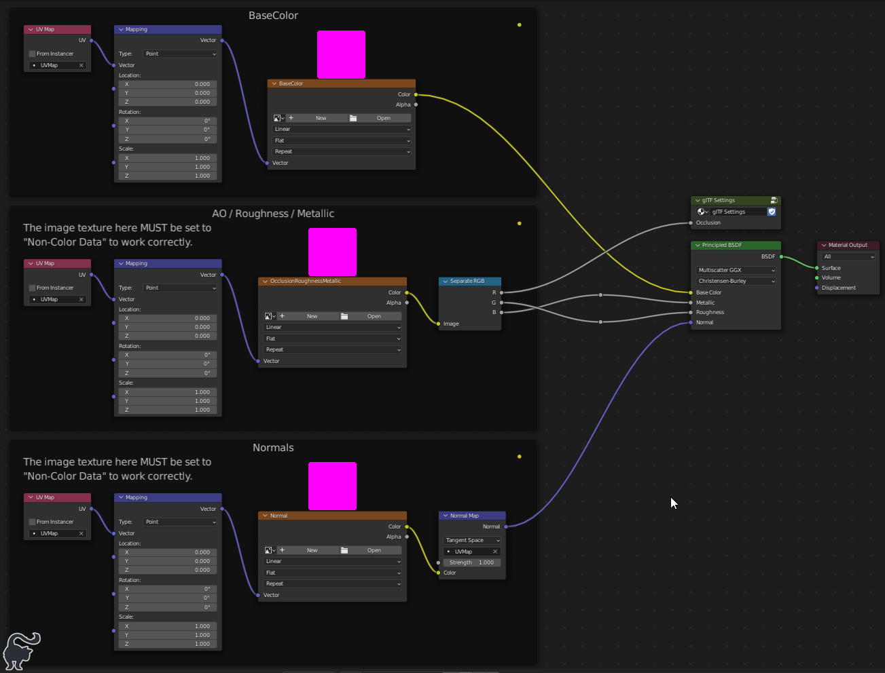

### Asset Pipline Overview

It's recommended to use the [Blender Asset Exporter](https://github.com/stom66/blender-asset-exporter) plugin to easily export multiple collections to glTF with a single click.

#### Blender template

- Use the file `/assets/models/blank-model.blend` as a starting point
- This file has the scene bounds references, as well as the default DCL materials linked in
- Re-using this as a starting point ensure all models are configured equally
- Open it, and immediately save it with the new models name, eg `/assets/models/my-model.blend`
- Rename the `_blank-model` collection, eg `_my-model`
- A single file can contain multiple objects to be exported, providing they are sorted into their own collections with the `_` prefix (required by the Asset Exporter)

#### Regular model, unwrapped to use existing textures

1. Make model in Blender
2. Use one of the existing basic DCL materials from this project to re-use textures
   - Add the current project as a Blender Asset Library in Settings -> File Paths
3. Export the model as `glTF` to `/dcl/models/<model_name>/<model_name>.gltf`
   - Use the settings described under [glTF Exports](/docs/CONFIGS.md#gltf-exports).
   - Use the the [Blender Asset Exporter](https://github.com/stom66/blender-asset-exporter) to speed up bulk/repeated exports
4. (Optional) Optimise the glTF textures with `scripts/png-optimise.sh`

#### Custom models, with Subtance painted textures

1. Make model in Blender:
   - Unwrap **UVs**, aiming for > 75% use
   - See [UVPackMaster profiles](/docs/CONFIGS.md#uvpackmaster3-profiles).
   - Use multiple tiles where a material requires more detail
   - Paint suitable **Vertex colors**
   - Add enough **Material slots** for the number of textures required (all slots initially set to use the same material, to facilitate painting in Substance)
2. Export the model as `FBX`
   - Use the settings described under [FBX exports](/docs/CONFIGS.md#fbx-exports)
3. Import and paint the model in Substance
   - Use the project settings described under [Substance Painter](/docs/CONFIGS.md#substance-painter)
4. Export the textures from Substance to `/assets/models/<model_name>/tex`
   - See notes below in [Textures](#textures)
5. Assign the textures to the materials in Blender, and assign the materials to the correct slots
   - See notes below in [Shaders](#shaders)
6. Export as a `glTF` to `/dcl/models/<model_name>/<model_name>.gltf`
   - Use the settings described under [glTF Exports](/docs/CONFIGS.md#gltf-exports).
7. (Optional) Optimise the glTF textures with `scripts/png-optimise.sh`

---

### Textures

Exported textures should be no larger than 1024px. The following names should be used:

- \*\_BaseColor.png
- \*\_ORM.png
- \*\_Normal.png
- \*\_Emissive.png (optional)

Note that we use a combined ORM (AO-Roughness-Metallic) map. See the shader config below for the node setup.

There are example export templates for Substance configured to use ORM in the `config` folder, [see here](/docs/CONFIGS.md#substance-painter).

---

### Shaders

There is an example material with correctly configured shaders for exporting to glTF in `assets/gltf-materials.blend`. Append this to your file, or re-create it as shown in the example below.

> Note: the AO map is optional.

Shaders must follow the setup shown here, due to the way the glTF exporter works. More information about it can be found in the Blender Wiki: [Import-Export glTF 2.0](https://docs.blender.org/manual/en/latest/addons/import_export/scene_gltf2.html)

