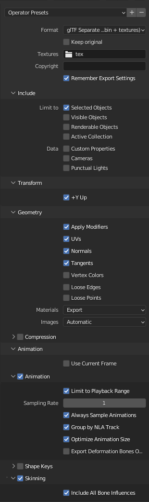
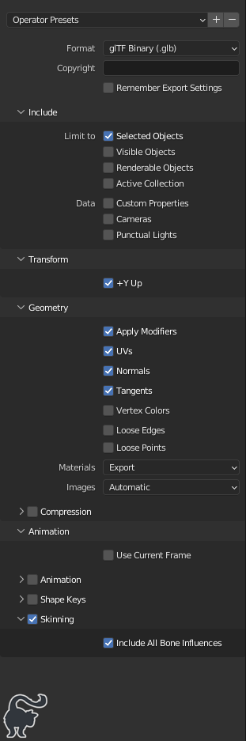
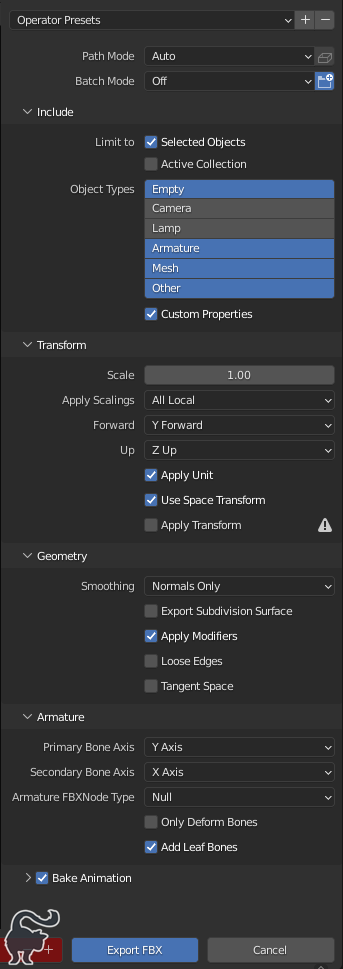
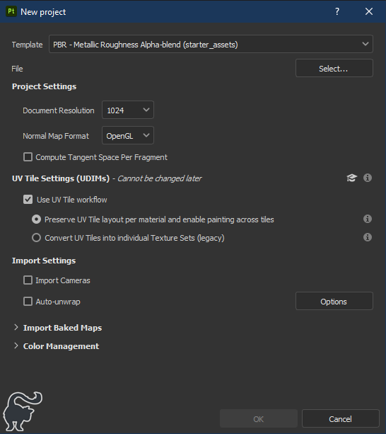
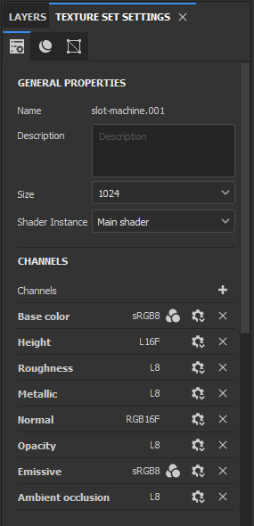

# Configurations

- [FBX exports](#fbx-exports)
- [glTF exports](#gltf-exports)
- [GLB exports](#glb-exports)
- [UVPackmaster3 profiles](#uvpackmaster3-profiles)
- [Substance Painter](#substance-painter)

---

# glTF Exports

Used when exporting models for use in the DCL scene.

Copy [DCL_Scene_glTF.py](/config/DCL_Scene_glTF.py) to:

```
%APPDATA%\Blender Foundation\Blender\3.1\scripts\presets\operator\export_scene.gltf\
```

This will import an export preset with the following settings (note the use of the `tex` folder):



---

# GLB Exports

Used when exporting wearables for upload to the market.

Copy [DCL_Wearables_GLB.py](/config/DCL_Wearables_GLB.py) to:

```
%APPDATA%\Blender Foundation\Blender\<version>\scripts\presets\operator\export_scene.gltf\
```

This will import an export preset with the following settings:



---

# FBX Exports

Only used when exporting to Substance Painter.

Copy the file [DCL_FBX.py](/config/DCL_FBX.py) to:

```
%APPDATA%\Blender Foundation\Blender\<version>\scripts\presets\operator\export_scene.fbx\
```

This will import an export preset with the following settings:



---

# UVPackMaster3 profiles

You can open these via the UVPM panel in Blender by clicking the menu icon in the "Main Mode" section of the UVPackMaster3 tab.

To avoid loading these profiles every time you can also copy them to:

```
%APPDATA%\UVPackmaster\Blender\Engine3\presets\
```

---

# Substance Painter

## Export templates

Copy the `.spexp` files in this folder to:

```
Documents\Adobe\Adobe Substance 3D Painter\assets\export-presets
```

## Project settings

When creating a new project use the following settings:

> IMPORTANT: DCL requires using **OpenGL** style normals, not DirectX



## Texture set settings

Use the texture set settings shown here:


